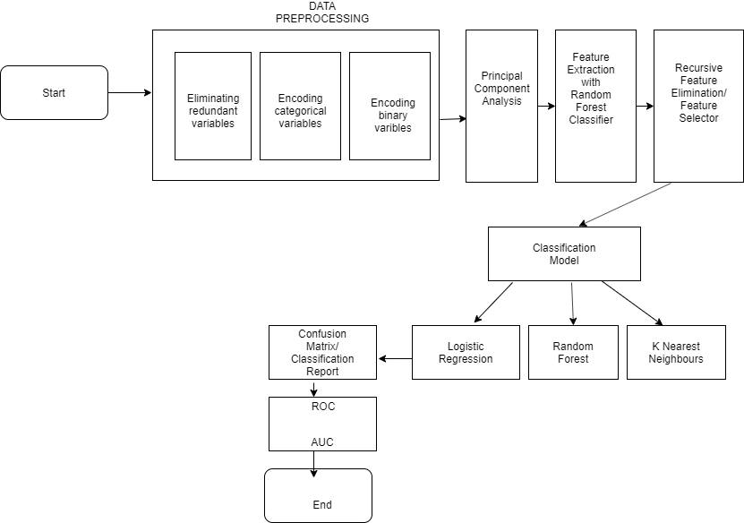
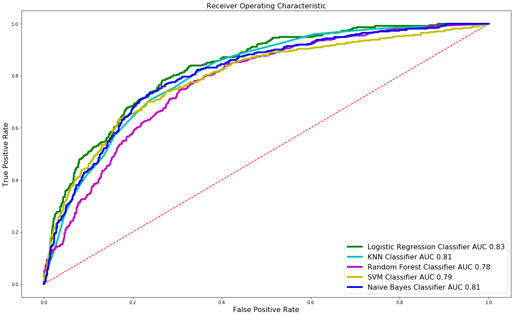

# Telco-Customer-Churn
Building a Predictive Churn Model that defines the steps and stages of customer churn, or a customer leaving your service or product.
Having a predictive churn model gives you awareness and quantifiable metrics to fight against in your retention efforts.

## Architecture

## Dataset
Telephone service companies, Internet service providers, TV companies, often use customer attrition analysis and customer attrition rates as one of their key business metrics because the cost of retaining an existing customer is far less than acquiring a new one.  
Companies from these sectors often have customer service branches which attempt to win back defecting clients, because recovered long-term customers can be worth much more to a company than newly recruited clients.   
The telco dataset is provided by __IBM__.   
Each row represents a customer, each column contains customer’s attributes described on the column Metadata.   
The data set includes information about:   
   
•	Customers who left within the last month – the column is called Churn   
•	Services that each customer has signed up for – phone, multiple lines, internet, online security, online backup, device protection, tech support, and streaming TV and movies   
•	Customer account information – how long they’ve been a customer, contract, payment method, paperless billing, monthly charges, and total charges   
•	Demographic info about customers – gender, age range, and if they have partners and dependents   
The dataset contains __7043__ Unique Values.   

## Classification Algorithms
> * Logistic Regression
> * K Nearest Neighbors
> * Random Forest
> * Kernel SVM
> * Naive Bayes

## Comparing Models
| Algorithms | Precision | Recall | F1-Score | Cross Validation Accuracy |
|------------|-----------|--------|----------|---------------------------|
| Logistic Regression | 0.84 | 0.89 | 0.86 | 80.44% |
| KNN | 0.82 | 0.87 | 0.84 | 79.25% |
| Random Forest | 0.81 | 0.86 | 0.83 | 75.64% |
| Kernel SVM | 0.82 | 0.89 | 0.86 | 80.03%
| Naive Bayes | 0.84 | 0.86 | 0.85 | 78.98% |
   

